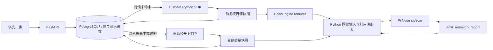
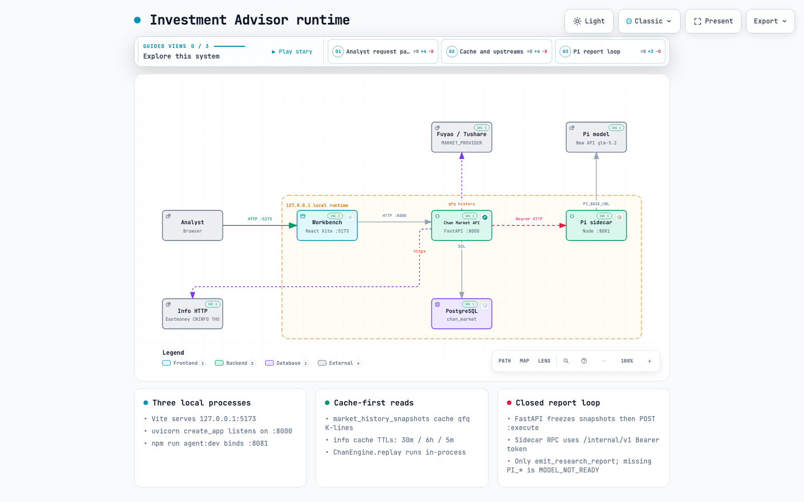

# 琪先一步

A 股结构投研台：Tushare → 缠论引擎 → Pi 投研报告。

这是一个可运行的 A 股结构投研 MVP：Python 从 Tushare 获取并缓存行情，
确定性 ChanEngine 计算结构，运行时公开 HTTP 数据源补充新闻、互动问答和热榜，
Node sidecar 让 Pi 只生成受证据引用约束的三情景研究叙述。React 页面将 K 线、
成交量、缠论结构、资讯证据和后续走势组合为一份完整报告。

## 数据链路



行情运行时数据源由 `MARKET_PROVIDER` 选择：`auto`（默认）、`hithink` 或 `tushare`。
`auto` 在检测到同花顺金融数据 API Key 时优先走扶摇 REST
（<https://fuyao.aicubes.cn>），日/周/月 K 使用前复权历史行情；分钟 K 仍回退 Tushare。
Key 读取顺序：`HITHINK_FINANCE_API_KEY`、`FUYAO_API_KEY`、`FUYAO_TOKEN`，
然后是用户级 `credentials.env`。不要把 Key 写入仓库。

未配置同花顺 Key 时继续使用 `TushareMarketProvider`：
运行时调用 `tushare.pro_api(TUSHARE_TOKEN)`，并在配置 `TUSHARE_API_URL`
时将 SDK 指向对应服务地址。Tushare 路径使用 `daily`、`adj_factor` 和
周线聚合所需的 `trade_cal`，前复权在本地按快照计算并写入哈希。

`a-stock-data` 同样只用于开发期确认公开数据契约，不是生产 SDK。运行时
`AStockDataProvider` 使用项目内的 `httpx` 直接请求三个来源：东财个股新闻、
巨潮互动易问答和同花顺小时热榜。后端只保存标题、摘要、公司回复、热度、排名
和概念标签等可验证事实，不根据标题推断利好或利空。

相关接口文档：

- [同花顺金融数据 API](https://fuyao.aicubes.cn/docs/)
- [Tushare daily](https://tushare.pro/document/1?doc_id=27)
- [Tushare adj_factor](https://tushare.pro/document/2?doc_id=28)
- [Tushare trade_cal](https://tushare.pro/document/2?doc_id=26)

## 运行时架构

GitHub 仓库页直接看下图。交互版是单文件 HTML：克隆后用浏览器打开
`docs/architecture/runtime-architecture.html`，主题切换、缩放和节点溯源都在文件内。

[交互图 HTML](docs/architecture/runtime-architecture.html)



## 目录

- `apps/api`：FastAPI、PostgreSQL、Tushare provider、ChanEngine 编排入口。
- `apps/api/app/domain/chan_engine.py`：包含处理、分型、严格笔、笔中枢，
  以及 confirmed/provisional 快照。
- `apps/agent-runtime`：Pi 状态机、Python RPC client、HTTP sidecar 和受限报告工具。
- `packages/contracts`：Node 状态机、证据引用和 `ReportDraftV2` 校验，并保留
  `ReportDraftV1` 读取兼容。
- `apps/web`：React/Vite 琪先一步工作台，使用 hash 导航提供今日批次和交易日记两个独立入口。
- `tests/api`：Python provider、引擎、分析接口和内部 RPC 测试。
- `docs/architecture`：运行时架构图（规格 JSON、交互 HTML、README 预览 PNG）。

## 启动

### 1. 安装依赖

```bash
uv sync
uv pip install -r requirements-market-data.txt
npm install
npm --prefix apps/web install --install-strategy=shallow
```

`pyproject.toml` 不强制安装 Tushare，保证离线单元测试可运行；需要真实行情时必须执行第二条命令并配置 token。

项目根目录的 `.env` 用于本地环境变量，已被 `.gitignore` 忽略。生产环境应使用部署平台的 secret 注入，不要把真实 token 提交到仓库。

### 2. 配置环境变量

```bash
MARKET_PROVIDER="auto"
HITHINK_FINANCE_API_KEY="你的同花顺金融数据 API Key"
HITHINK_FINANCE_API_URL="https://fuyao.aicubes.cn"
TUSHARE_TOKEN="你的 Tushare token"
TUSHARE_API_URL="https://你的-tushare-服务.example/api"
DATABASE_URL="postgresql://niko@127.0.0.1:5432/chan_market"
INTERNAL_AGENT_TOKEN="FastAPI 与 sidecar 共享的内部 token"
AGENT_RUNTIME_URL="http://127.0.0.1:8081"
PYTHON_API_BASE_URL="http://127.0.0.1:8000"
PI_AGENT_PORT="8081"
PI_PROVIDER="new-api"
PI_MODEL="glm-5.2"
PI_BASE_URL="https://你的-new-api-服务.example/v1/chat/completions"
PI_API_KEY="模型服务 API key"
VITE_API_BASE_URL="http://127.0.0.1:8000"
```

`HITHINK_FINANCE_API_KEY` 是扶摇同花顺 REST 凭据，不要提交到 Git；也可只放在用户级
`credentials.env`。`TUSHARE_TOKEN` 仍用于分钟线回退和未配置同花顺 Key 时的日线。
第三方 Tushare 套餐 Token 必须同时配置对应的 `TUSHARE_API_URL`；未配置地址时使用
Tushare SDK 默认服务。
`DATABASE_URL` 指定 PostgreSQL 连接串，必须配置；缺失时服务启动直接失败，
不再支持内存或 SQLite 数据库。
`INTERNAL_AGENT_TOKEN` 是 FastAPI 与 Node sidecar 之间的必需共享凭据，两边
必须使用同一个非空值；浏览器不会接触该值。
`AGENT_RUNTIME_URL` 默认是 `http://127.0.0.1:8081`，
`PYTHON_API_BASE_URL` 默认是 `http://127.0.0.1:8000`，`PI_AGENT_PORT` 默认是
`8081`，本地使用默认端口时可以省略这三项。
Vite 会从项目根目录 `.env` 读取 `VITE_API_BASE_URL`；未配置时前端使用
内置 mock API。FastAPI 本地开发环境允许 `127.0.0.1:5173` 和
`localhost:5173` 跨域访问。
`PI_PROVIDER`、`PI_MODEL`、`PI_API_KEY` 三项同时存在时，
Node sidecar 才会创建真实 Pi session；配置 `PI_BASE_URL` 时使用
OpenAI 兼容接口，当前示例对应 New API 的 `glm-5.2`。
缺少其中任意一项时，sidecar 的 `/health/ready` 返回 `503`，报告生成返回
`MODEL_NOT_READY`；生产运行不会自动生成假报告。
模型凭据不会通过 HTTP 请求体传入。

New API 的兼容层只允许标准消息角色，sidecar 会关闭 `developer` 角色并强制
报告工具调用。`PI_BASE_URL` 可以填写兼容 API 根地址或完整的
`/v1/chat/completions` 地址，sidecar 会统一规范化；生产环境应使用 HTTPS 或
私网链路。

### 3. 启动服务

分别打开三个终端：

```bash
uv run --env-file .env uvicorn --factory app.main:create_app \
  --app-dir apps/api --host 127.0.0.1 --port 8000
```

```bash
npm run agent:dev
```

```bash
npm --prefix apps/web run dev
```

默认地址：

- Web：<http://127.0.0.1:5173>
- Python API：<http://127.0.0.1:8000>
- Pi sidecar：<http://127.0.0.1:8081>

前端菜单对应 `#/advisory`（兼容 `#/batch`）和 `#/journal`，支持刷新及浏览器前进、后退。
点击“生成投顾报告”会为当前自选池逐只创建日线 Report V2 任务，页面立即显示
排队状态并每两秒刷新进度；已完成的报告会自动进入对应股票的 AI 条件展望区。
投顾报告与交易日记互不共用数据：前者是自选池结构分析，后者是成交账本与周期复盘。
投顾报告桌面端将自选池和生成进度集中在左侧，结构报告位于右侧主分析区。
公司新闻与互动问答默认各显示前 4 条，点击栏目底部按钮可展开或收起全部资讯。

报告通过审阅并发布后，在“对客交付”区域点击“生成分享链接”，再点击“打开对客报告”
进入独立分享页。分享页页头可导出 PDF，或下载包含完整报告和缠论图表的 PNG 长图；导出文件
不会包含操作按钮。

交易工作流使用独立入口，不复用“研究记录”：

- `#/journal`：创建唯一交易账户，录入成交和资金流水，并保存或完成每日收盘检查。
- `#/reviews`：选择周、月、季、年完整周期，查看确定性复盘、版本历史、理由事实、
  交易周期以及包含权益、回撤、未复权 K 线、成交量、缠论与历史买卖点的图表。

复盘页只呈现后端已固化的确定性快照。交易复盘 Pi 文字总结尚无公开生成接口时，
页面会如实显示“尚未请求”，不会虚构 AI 分析。

## 缠论图表

结构报告使用 TradingView Lightweight Charts 展示真实前复权行情，而不是静态示意图：

- K 线来自 Tushare `daily + adj_factor` 固化结果。
- K 线下方的成交量柱来自 `daily.vol`，单位为手；周线成交量是该周日线成交量
  之和。
- 青绿色实线表示已确认笔，青绿色虚线表示形成中笔。
- 琥珀色半透明区间表示由自定义 Primitive 绘制的笔中枢。
- 默认展示最近约六个月，通过滚轮缩放或拖动查看完整五年。
- 默认加载日线，点击“周线”后按需加载并缓存周线结果。
- K 线与成交量共用日期轴和缩放窗口；悬停图表可查看日期、开高低收、成交量和
  对应结构状态，缺失成交量显示为 `—`。
- 图表保留 Lightweight Charts 官方 attribution 标识。

结构坐标来自 ChanEngine 包含处理后的 K 线，并在前端转换为日期后叠加到
原始前复权 K 线。这样既保留真实蜡烛图，又不会把结构索引错误套到原始数组。

## 本地行情缓存

FastAPI 会按股票、周期、前复权方式、截止日期和五年窗口固化行情快照。
同一交易日再次查看相同股票时直接读取 PostgreSQL，不再调用 Tushare。
日线首次拉取后，周线由已缓存的日线在本地聚合，因此切换周线也不会重复拉取
该股票的五年历史行情。缓存使用请求截止日期隔离，避免不同截止日的前复权结果
互相覆盖。

本地开发使用本机 PostgreSQL 实例，首次只需建库：

```bash
createdb -h 127.0.0.1 -p 5432 chan_market
```

并在 `.env` 中配置：

```bash
DATABASE_URL="postgresql://niko@127.0.0.1:5432/chan_market"
```

生产环境使用托管 PostgreSQL 并通过 secret 注入连接串。

## 本地资讯缓存与降级

资讯按来源写入同一个 PostgreSQL 数据库，并使用独立有效期：

- 东财个股新闻：按股票缓存 30 分钟。
- 巨潮互动易：按股票缓存 6 小时。
- 同花顺小时热榜：全市场共享缓存 5 分钟，再按股票过滤。

有效缓存直接查库，不请求上游。同一来源和缓存键的并发刷新会合并为一次请求。
缓存过期时优先刷新；上游失败且存在旧数据时返回 `stale`，单源失败时整体为
`degraded`，全部来源失败且没有缓存时为 `unavailable`。资讯故障不会清空行情、
缠论图表或其他可用来源。响应中的来源状态固定为 `fresh`、`cached`、`stale` 或
`unavailable`，整体质量固定为 `ok`、`degraded` 或 `unavailable`。

## API 示例

查询昂利康的 Tushare 行情、成交量和缠论快照：

```bash
curl "http://127.0.0.1:8000/api/market/002940.SZ/analysis?timeframe=1d"
curl "http://127.0.0.1:8000/api/market/002940.SZ/analysis?timeframe=1w"
```

查询独立资讯快照：

```bash
curl "http://127.0.0.1:8000/api/market/002940.SZ/information?limit=10"
```

创建完整走势报告。首次创建返回 `202` 和 `queued` 状态：

```bash
curl -i -X POST \
  http://127.0.0.1:8000/api/market/002940.SZ/reports \
  -H 'content-type: application/json' \
  -d '{"timeframe":"1d"}'
```

前端每两秒轮询，进入 `completed` 或 `failed` 后停止：

```bash
REPORT_ID="替换为创建响应中的 report_id"
curl "http://127.0.0.1:8000/api/reports/${REPORT_ID}"
```

只有 `failed` 且 `error.retryable=true` 的原报告可以通过专用接口重试。重试复用
原有固化输入，不重新抓取已过期资讯：

```bash
curl -X POST "http://127.0.0.1:8000/api/reports/${REPORT_ID}/retry"
```

相同 `input_digest` 的 `queued` 或 `running` 请求复用同一个 job；已完成的相同输入
返回 `200`、同一 `report_id` 和 `cached: true`。digest 覆盖股票、周期、截止日、
三类快照、引擎与提示版本以及模型配置。

## 对客研报闭环

研报面向客户，交付前后各有一道关口：发布前由人工审阅质检，发布后按真实行情
验证情景是否兑现。两者共同构成可追溯的 track record。

### 审阅与发布

审阅只接受 `accepted` 或 `rejected`，且只能对 `completed` 报告提交；未通过审阅
的报告无法发布：

```bash
curl -X POST "http://127.0.0.1:8000/api/reports/${REPORT_ID}/reviews" \
  -H 'content-type: application/json' \
  -d '{"reviewer":"analyst","decision":"accepted","note":"结构事实可追溯"}'

curl -X POST "http://127.0.0.1:8000/api/reports/${REPORT_ID}/publish"
curl "http://127.0.0.1:8000/api/reports/published"
```

审阅记录追加保存，最后一次决定决定报告的 `review_status`；重复发布保持首次
`published_at` 不变。

### 情景兑现评估

报告的触发与失效条件由算子和引用注册表中的事实构成，价格类条件可以按真实
行情确定性判定：

```bash
curl -X POST "http://127.0.0.1:8000/api/reports/${REPORT_ID}/outcome"
curl "http://127.0.0.1:8000/api/reports/${REPORT_ID}/outcome"
```

判定规则固定为：`break_above` 与 `break_below` 看窗口内是否出现收盘价越过水平，
`hold_above` 与 `hold_below` 要求窗口内每个收盘价都不越界。展望窗口取报告固化
日之后的 20 个交易日，满 5 个交易日才给出结论，未满时返回 `pending`。

窗口行情会按报告固化时的前复权基准换算后再比较。Provider 的前复权以取数窗口
最后一个交易日为基准，事后重新取数会换基准；服务以报告最后一根 K 线为锚点做
整体换算，避免期间分红或拆股让固化价格水平失真。

结构类条件（`structure_confirmed`、`structure_invalidated`）需要重放缠论才能判定，
当前显式返回 `structure_condition_not_replayable`，不做推测。

裁决口径：触发命中且失效未命中才算该情景兑现。恰好一个情景满足记为 `realized`，
多个同时满足记为 `ambiguous`，都不满足记为 `none_realized`，存在无法判定的条件
且无情景兑现记为 `inconclusive`。

### 质量看板

```bash
curl "http://127.0.0.1:8000/api/reports/quality"
curl "http://127.0.0.1:8000/api/reports/quality?scope=all"
```

默认 `scope=published`，只统计 `published_at` 非空的报告：被驳回或尚未发布的
报告不进对客 track record。`scope=all` 是内部复盘视角，包含全部报告。

兑现率给出两个口径：`realized_rate_over_conclusive` 的分母只算有明确结论的
样本（`realized` 加 `none_realized`），`realized_rate_over_evaluated` 的分母是
全部已评估样本，把 `ambiguous` 与 `inconclusive` 也算作没兑现，是更保守、也更
接近客户体感的口径。样本不足时两者都返回 `null`，不用推测值填充。

`investment_report.v2` 固化行情、缠论、资讯、引用注册表和 AI 草稿，输出未来
5 至 20 个交易日的上涨、基准和下跌三种情景。每个情景包含依据、触发条件和
失效条件；服务端按注册表水合标签、数值、时间与原文链接，并附加固定免责声明
和初始 `pending` 审阅状态。

### 引用注册表的价格水平

价格类条件只能引用注册表里的水平，注册表按"仍然可用"的口径筛选：

- `market.latest_close` 是固化日收盘，同时充当条件校验的锚点。
- `market.recent_high` 与 `market.recent_low` 是整个五年固化窗口的极值，
  `occurred_at` 指向极值实际发生的那根 K 线。
- `market.recent_high_60` 与 `market.recent_low_60` 取最近六十根固化 K 线的
  高低点，是贴近现价、通常还没有被突破的边界。
- `chan.center.upper` 与 `chan.center.lower` 只在仍然包含固化日收盘的中枢上
  暴露。缠论引擎对每三笔滑窗都产出一个中枢，最新那个可能早已被价格甩开；没有
  任何中枢包含现价时两个引用一并省略，此时模型改用近端高低价作为边界。

两端校验都会拒收在固化时点就已经被解决的价格条件：`break_above` 指向已被越过
的水平、`break_below` 指向已被跌破的水平、`hold_above` 指向已被跌破的水平、
`hold_below` 指向已被越过的水平。这类条件在展望窗口第一根 K 线上必然命中，只是
复述既成事实。注意收盘正好位于 `hold_above` 水平上方是正常且必要的，不算退化。

资讯快照与行情固化到同一个 `as_of`：新闻与互动问答按发布时间不晚于该日东八区
结束时刻过滤；同花顺热榜只有实时快照、没有历史序列，历史时点直接置为不可用并在
`quality.warnings` 里说明原因，不用今天的数据冒充历史。

工作台只展示完整缠论图表、三情景正文、触发与失效条件、风险边界和免责声明。
结构结论、结构事实列表及证据引用明细保留在 Report V2 数据中，不在页面重复
展示；独立的新闻、互动问答和市场热度区域不受影响。

## 交易日记与周期复盘

交易账户、成交记录、资金流水和每日收盘复盘都写入 PostgreSQL，并按上海时区保存。
成交记录要求填写买入或卖出理由；每日复盘可记录失效条件、次日计划、情绪和纪律
执行情况。

月、周、季、年视图直接展示当前周期累计收益曲线；计算口径剔除入金、出金，并以
周期首个正净值点归零；列表视图不展示该曲线。

```bash
curl -X POST http://127.0.0.1:8000/api/trading/account \
  -H 'content-type: application/json' \
  -d '{"name":"主账户","activated_on":"2026-01-01","initial_capital":"100000"}'

curl -X POST http://127.0.0.1:8000/api/trading/executions \
  -H 'content-type: application/json' \
  -d '{"symbol":"002940.SZ","name":"昂利康","executed_at":"2026-01-05T10:00:00+08:00","side":"buy","price":"20.00","quantity":100,"fee":"5.00","primary_reason":"pullback_confirmation","tags":[],"note":"回踩确认","client_idempotency_key":"11111111-1111-4111-8111-111111111111"}'

curl -X PUT http://127.0.0.1:8000/api/trading/daily-reviews/2026-01-05 \
  -H 'content-type: application/json' \
  -d '{"status":"completed","invalidation_condition":"跌破前低","next_day_plan":"观察量价配合","emotion":"calm","discipline_followed":true,"note":"按计划执行"}'
```

周期复盘接口支持 `week`、`month`、`quarter` 和 `year`。月、季、年必须传自然
周期边界；服务端会将周末和节假日归一到实际交易日，并把报告输入、行情依赖、
每日复盘和图表快照固化。创建报告返回 `202` 和 `queued`，随后通过报告 ID 查询
状态；相同输入摘要会复用已有任务，失败任务使用专用 retry 接口重试。

```bash
curl -X POST http://127.0.0.1:8000/api/trading/reports \
  -H 'content-type: application/json' \
  -d '{"period_kind":"week","period_start":"2026-01-05","period_end":"2026-01-09"}'

REPORT_ID="替换为创建响应中的 report_id"
curl "http://127.0.0.1:8000/api/trading/reports/${REPORT_ID}"
curl -X POST "http://127.0.0.1:8000/api/trading/reports/${REPORT_ID}/retry"
```

报告中的确定性指标包括收益、胜率、盈亏比、最大回撤、持仓周期、理由表现、纪律
执行、净值曲线和前后周期比较；样本不足或行情未就绪时会明确返回质量警告，不会
用推测值填充。

周期复盘可按股票进入个股 BS 分析：本周期盈亏块、日线 / 30 分钟 K 线、实盘 B/S
与手标。手标独立于账本，不改持仓、已实现盈亏或成功率，也不写入报告快照；Pi 不
读取手标评论。30 分钟行情失败时仍可使用日线 BS 分析。

## Pi 安全边界

报告状态机固定执行四步：`fetch_market_snapshot`、`run_chan_analysis`、
`collect_information_evidence`、`emit_research_report`。前三步只从 Python 已固化
输入读取行情、结构和资讯；只有最后一步进入真实 Pi session。

Pi session 只启用 `emit_research_report` 自定义工具，不启用 read、bash、write、
edit、skills、context 等本地工具。模型只能填写标题、摘要、三情景叙述和当前
run 已有的引用；Node 和 Python 都会校验三类证据覆盖、条件与事实类型、未知引用、
数字价格和交易指令。Tushare 数值、时间、结构事实、新闻事实和免责声明不由模型
生成。

## 当前范围与限制

- 首版只接受沪深个股代码，例如 `600519.SH`、`000858.SZ`；不包含指数、基金、港股和分钟线。
- 日线默认取最近五年；周线由日线聚合，并排除尚未结束的周。
- 前复权使用 `daily` 与 `adj_factor` 本地计算，不把供应商返回的动态 `pro_bar` 结果当作业务事实源。
- 当前资讯只覆盖东财新闻、巨潮互动易和同花顺小时热榜，不包含资金面、研报全文
  或基本面预测；公开上游可能限流或变更结构，接口会明确返回来源质量状态。
- Tushare 的积分、频控和接口权限由部署账号负责；token 缺失、未安装 SDK 或权限不足时，API 返回安全摘要错误。
- 报告仅供研究参考，不构成个性化投资建议、交易指令或收益承诺。

## 验证

```bash
uv run --offline ruff check apps/api tests/api
uv run --offline pytest -q tests/api
npm test
npx tsc --noEmit
npm --prefix apps/web test -- --run --reporter=dot
npm --prefix apps/web run typecheck
npm --prefix apps/web run build
uv run --offline pytest -q tests/integration/test_full_report_flow.py
npx --yes markdownlint-cli2 README.md \
  docs/superpowers/specs/2026-08-12-full-investment-report-design.md \
  docs/superpowers/plans/2026-08-13-full-investment-report.md
```

启动三个服务后，用昂利康执行最小真实验收：

```bash
curl -fsS "http://127.0.0.1:8000/api/market/002940.SZ/analysis?timeframe=1d"
curl -fsS "http://127.0.0.1:8000/api/market/002940.SZ/analysis?timeframe=1w"
curl -fsS "http://127.0.0.1:8000/api/market/002940.SZ/information?limit=10"
curl -fsS -X POST \
  http://127.0.0.1:8000/api/market/002940.SZ/reports \
  -H 'content-type: application/json' \
  -d '{"timeframe":"1d"}'
```

随后用创建响应中的 `report_id` 轮询 `/api/reports/{report_id}`，确认最终状态为
`completed`、`schema_version` 为 `investment_report.v2`，三种情景和行情、缠论、
资讯引用齐全。重复执行同一资讯请求应命中有效缓存；重复创建未变化的报告输入应
返回同一 `report_id` 和 `cached: true`。
